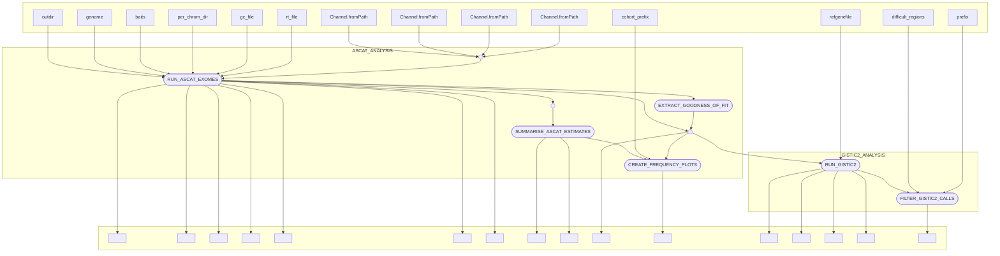

# dermatlas_copy_number_nf

[](https://www.nextflow.io/)
[](https://www.docker.com/)
[](https://sylabs.io/docs/)

## Introduction

dermatlas_copy_number_nf is a bioinfromatics pipeline written in nextflow for performing copy-number alteration (CNA) analysis on cohorts of tumors within the Dermatlas project. 

## Pipeline summary

In brief, the pipeline takes a cohort of samples that have been ingested and preprocessed and:
- Links cohort sample metadata to sample bamfiles and links pairs for each tumor/normal sample.
- Runs ASCAT on each tumor-normal pair, outputting segment calls. 
- Collates summary statistics for the ASCAT runs and removes those samples below a threshold Goodness-of-Fit level 
- Merges the segment calls from ASCAT that pass filtering.
- Runs GISTIC2 to identify regions with significant copy-number alterations (CNAs).
- Filters GISTIC calls to identify those that overlap with ASCAT.

## Inputs 

`bam_files`: a wildcard containing a path to a directory containing a Bamfiles 
`index_files`: a path to the corresponding .bai index files for those BAMS 
Sample metadata: path to a file containing sample PD IDs, tumor normal info, and sex
`tumor_normal_pairs`: path to a file containing a tab-delimited list of matched tumour and normal pairs.

The following reference files, which will be used across pipeline executions are located within the `nextflow.config` file.
`reference_genome`
`bait_set`
`resource_files`
`gc_file`
`rt_file`
`gistic_refgene_file`
`difficult_regions_file`

## Usage 
The recommended way to launch this pipeline is using a wrapper script that records the revision (-r ) and the specific params `json` file supplied for a run. 

Basic Sanger FARM usage:
```
#!/bin/bash
#BSUB -q normal
#BSUB -G cellularoperations
#BSUB -R "select[mem>8000] rusage[mem=8000] span[hosts=1]"
#BSUB -M 8000
#BSUB -oo nf_out.o
#BSUB -eo nf_out.e

PARAMS_FILE="/lustre/scratch125/casm/team113da/users/jb63/nf_cna_testing/params.json"

module load nextflow-23.10.0
module load singularity
module load /software/team113/modules/modulefiles/tw/0.6.2

nextflow run 'https://gitlab.internal.sanger.ac.uk/DERMATLAS/analysis-methods/dermatlas_copy_number_nf' \
-r feature/config_dmemo \
-params-file $PARAMS_FILE \
-c /lustre/scratch125/casm/team113da/users/jb63/nf_cna_testing/nextflow.config \
-profile farm22 
```
This can also 

A usage profile for OpenStack secure-lustre instances is provided. 
`-profile secure-lustre`


## Pipeline visualisation 



## Testing

This pipeline has been built with nf-test framework to generate unit tests and perfom some integration tesing. Small test data is provided within test/testdata and snapshots for outputs of steps have been provided to detect regressions. You can run all tests with:

```
nf-test test 
```
Individual tests with:
```
nf-test test tests/modules/ascat_exomes.nf.test
```