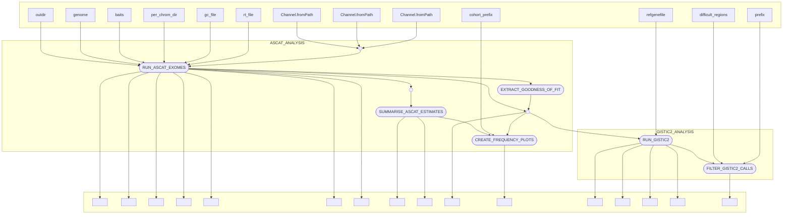

# dermatlas_copy_number_nf

[](https://www.nextflow.io/)
[](https://www.docker.com/)
[](https://sylabs.io/docs/)

## Introduction

dermatlas_copy_number_nf is a bioinfromatics pipeline written in [Nextflow](http://www.nextflow.io) for performing copy-number alteration (CNA) analysis on cohorts of tumors within the Dermatlas project. 

## Pipeline summary

In brief, the pipeline takes a cohort of samples that have been pre-processed by the Dermatlas ingestion pipeline and then:
- Links a sample's metadata to it's associated bamfile and links pairs of samples each tumor/normal pair.
- Runs ASCAT on each tumor-normal pair, outputting segment calls. 
- Collates summary statistics for the ASCAT runs and filters out samples that fall below a threshold Goodness-of-Fit level.
- Merges the segment calls from ASCAT that pass filtering.
- Runs GISTIC2 to identify regions with significant copy-number alterations (CNAs).
- Filters GISTIC calls to identify those that overlap with ASCAT.

## Inputs 

### Cohort variables
- `bam_files`: wildcard capturing the path to a set of `.bam` files in a project directory and their corresponding `.bam.bai` index files. Note: the pipeline assumes that index files have been pre-generated and are co-located with bams.
- `metadata_manifest`: path to a tab-delimited manifest containing sample PDIDs and information about sample phenotype/preparation.
- `tumor_normal_pairs`: path to a file containing a tab-delimited list of matched tumour and normal pairs.

### Reference files 
References that are reused across pipeline executions have been placed within the pipeline's default `nextflow.config` file to simplify configuration. The following reference files are required for a run: 
- `reference_genome`: path to a reference genome file (ASCAT).
- `bait_set`: path to a `.bed` file describing the analysed genomic regions  ( ASCAT).
- `resource_files`: path to a directory containing ASCAT loci and allele.
- `gc_file`: path to the ASCAT GC correction file.
- `rt_file`: path to the GISTIC replication timing correction file.
- `difficult_regions_file`: genomic regions considered to be 
problematic for analyses such as variant calling by Genome In A Bottle (GIAB).

## Usage 

The recommended way to launch this pipeline is using a wrapper script that records the revision (-r ) and the specific params `json` file supplied for a run (e.g. `bsub < my_wrapper.sh`)

An example wrapper script:
```
#!/bin/bash
#BSUB -q normal
#BSUB -G cellularoperations
#BSUB -R "select[mem>8000] rusage[mem=8000] span[hosts=1]"
#BSUB -M 8000
#BSUB -oo nf_out.o
#BSUB -eo nf_out.e

PARAMS_FILE="/lustre/scratch125/casm/team113da/users/jb63/nf_cna_testing/params.json"

module load nextflow-23.10.0
module load singularity
module load /software/team113/modules/modulefiles/tw/0.6.2

nextflow run 'https://gitlab.internal.sanger.ac.uk/DERMATLAS/analysis-methods/dermatlas_copy_number_nf' \
-r feature/config_dmemo \
-params-file $PARAMS_FILE \
-c /lustre/scratch125/casm/team113da/users/jb63/nf_cna_testing/nextflow.config \
-profile farm22 
```

The pipeline has been configured to run on Sanger OpenStack secure-lustre instances and farm22. Different configurations can be launched by specifying:
`-profile secure-lustre` or `-profile farm22`


## Pipeline visualisation 
Created using nextflow's inbuilt visualitation features.



## Testing

This pipeline has been developed with the [nf-test](http://nf-test.com) testing framework. Unit tests and small test data are provided within the pipeline within the `test` subdirectory. A snapshot has been taken of the outputs of most steps in the pipeline to help detect regressions. You can run all tests on Openstack with:

```
nf-test test 
```
and individual tests with:
```
nf-test test tests/modules/ascat_exomes.nf.test
```

For faster testing of dataflow through the pipeline **without running any of the tools involved**
```
nextflow run main.nf \
-params-file params.json \
-c tests/nextflow.config \
--stub-run
```


