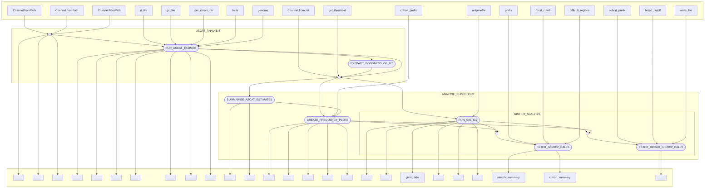

# dermatlas_copy_number_nf

[](https://www.nextflow.io/)
[](https://www.docker.com/)
[](https://sylabs.io/docs/)

|                         Main                         |                         Develop                          |
| :----------------------------------------------------: | :------------------------------------------------------: |
| [![pipeline status][master-pipe-badge]][main-branch] | [![pipeline status][develop-pipe-badge]][develop-branch] |

[master-pipe-badge]: https://gitlab.internal.sanger.ac.uk/DERMATLAS/analysis-methods/dermatlas_copy_number_nf/badges/main/pipeline.svg
[main-branch]: https://gitlab.internal.sanger.ac.uk/DERMATLAS/analysis-methods/dermatlas_copy_number_nf/-/commits/main
[develop-pipe-badge]: https://gitlab.internal.sanger.ac.uk/DERMATLAS/analysis-methods/dermatlas_copy_number_nf/badges/develop/pipeline.svg
[develop-branch]: https://gitlab.internal.sanger.ac.uk/DERMATLAS/analysis-methods/dermatlas_copy_number_nf/-/commits/develop

## Introduction

`dermatlas_copy_number_nf` is a bioinformatics pipeline written in [Nextflow](http://www.nextflow.io) for performing copy number alteration (CNA) analysis on cohorts of tumors within the [Dermatlas project](https://www.dermatlasproject.org). 

## Pipeline summary

In brief, this pipeline takes sets matched tumor-normal samples that have been pre-processed by the Dermatlas ingestion process and then:
- Links each sample bamfile to it's associated metadata.
- Links tumor-normal pairs.
- Runs ASCAT on each tumor-normal pair, outputting segment calls and diagnostic plots. 
- Collates summary statistics for all ASCAT runs and filters out samples that fall below a threshold Goodness-of-Fit level (GOF <90%).
- Merges the segment calls from ASCAT that pass filtering.
- Runs GISTIC2 on the merged segment calls to identify regions with significant copy-number alterations in the cohort (CNAs).
- Filters GISTIC2 calls to identify those that overlap with ASCAT and which pass a Q-value threshold.

## Inputs 

### Cohort-dependent variables
- `bam_files`: path to the top-level directory for a set of `.bam` files. **Note:** *pipeline assumes that corresponding `.bam.bai` index files have been pre-generated and are co-located with bams and you should use a `**` glob match to recursively collect all bamfiles in the directory.*
- `all_samples`: path to a file containing a tab-delimited list of all matched tumour-normal pairs in a cohort.
- `metadata_manifest`: path to a tab-delimited manifest containing information about sample phenotype and preparation. Columns can be specified using the following variables. Defaults columns and allowed values are:
    - `col_sex` (Default: `Sex`) - **M or F**
    - `col_sample_id` (Default: `Sanger_DNA_ID`) - **ID of the sample (e.g. PD001234)**
    - `col_include` (Default: `OK_to_analyse_DNA?`) - **Y or N**
    - `col_TN` (Default: `Phenotype`) - **T or N**


**Optional**
- `subcohorts`: a map defining subcohort analyses to run after ASCAT completes. Each entry maps a subcohort name to its configuration with `sample_list` and `plot_dir`:

  ```groovy
  subcohorts = [
      "independent_tumours": [
          sample_list: "/path/to/independent_tumours_matched.tsv",
          plot_dir: "PLOTS_INDEPENDENT"
      ],
      "one_tumour_per_patient": [
          sample_list: "/path/to/one_tumour_per_patient_matched.tsv",
          plot_dir: "PLOTS_ONE_PER_PATIENT"
      ]
  ]
  ```

  Each sample list file should be tab-delimited with `tumor` and `normal` columns specifying the matched pairs for that subcohort.

### Cohort-independent variables
Reference files that are reused across pipeline executions have been placed within the pipeline's default `nextflow.config` file to simplify user configuration and can be ommited from setup. Behind the scences the following reference files are required for a run: 
- `reference_genome`: path to a reference genome fasta file.
- `bait_set`: path to a `.bed` file describing the analysed genomic regions.
- `resource_files`: path to a directory containing ASCAT loci and allele files.
- `gc_file`: path to the ASCAT GC correction file.
- `rt_file`: path to the ASCAT replication timing correction file.
- `difficult_regions_file`: path to a file containing genomic regions considered to be problematic for analyses such as variant calling by Genome In A Bottle (GIAB); used by GISTIC2 for masking regions.
- `chrom_arms_file`: path to the file containing chromosome arm lengths.
- `gistic_broad_peak_q_cutoff`: a Q-value cutoff to be used when fitlering Gistic broad peak outputs (default 0.1).

Default reference file values supplied within the `nextflow.config` file can be overided by adding them to the params `.json` file. An example complete params file `example_params.json` is supplied within this repo for demonstation.

## Usage 

The recommended way to launch this pipeline is using a wrapper script (e.g. `bsub < my_wrapper.sh`) that submits nextflow as a job and records the version (**e.g.** `-r 0.6.1`)  and the `.json` parameter file supplied for a run.

An example wrapper script:
```
#!/bin/bash
#BSUB -q oversubscribed
#BSUB -G team113-grp
#BSUB -R "select[mem>8000] rusage[mem=8000] span[hosts=1]"
#BSUB -M 8000
#BSUB -oo analysis/logs/copy_number_variants_pipeline_%J.o
#BSUB -eo analysis/logs/copy_number_variants_pipeline_%J.e


export PROJECT_DIR="TBC"
export STUDY=TBC
export PROJECT=TBC
export COHORT="TBC"

# Load module dependencies
module load nextflow-23.10.0
module load /software/modules/ISG/singularity/3.11.4

# Create a nextflow job that will spawn other jobs

nextflow run "https://github.com/team113sanger/dermatlas_copy_number_nf" \
-r 1.1.0 \
-c commands/copy_number.config \
-profile farm22 \
-resume 
```

When running the pipeline for the first time on the farm you will need to provide credentials to pull singularity containers from the team113 sanger gitlab. You should be able to do this by running
```
module load singularity/3.11.4 
singularity remote login --username $(whoami) docker://gitlab-registry.internal.sanger.ac.uk
```

The pipeline can configured to run on either Sanger OpenStack secure-lustre instances or farm22 by changing the profile speicified:
`-profile secure_lustre` or `-profile farm22`. 

## Pipeline visualisation
Created using nextflow's in-built visualisation features.


```mermaid
flowchart TB
    subgraph " "
    v0["Channel.fromPath"]
    v1["Channel.fromPath"]
    v2["Channel.fromPath"]
    v27["genome"]
    v28["baits"]
    v29["per_chrom_dir"]
    v30["gc_file"]
    v31["rt_file"]
    v43["gof_threshold"]
    v49["Channel.fromList"]
    v74["cohort_prefix"]
    v81["refgenefile"]
    v90["difficult_regions"]
    v91["focal_cutoff"]
    v92["prefix"]
    v98["arms_file"]
    v99["broad_cutoff"]
    v100["cohort_prefix"]
    end
    subgraph " "
    v11[" "]
    v24[" "]
    v26[" "]
    v33[" "]
    v34[" "]
    v35[" "]
    v36[" "]
    v37[" "]
    v38[" "]
    v39[" "]
    v61[" "]
    v62[" "]
    v76[" "]
    v77[" "]
    v78[" "]
    v79[" "]
    v80[" "]
    v83[" "]
    v84[" "]
    v85["gistic_tabs"]
    v86[" "]
    v87[" "]
    v88[" "]
    v94["sample_summary"]
    v95["cohort_summary"]
    v102[" "]
    end
    subgraph ASCAT_ANALYSIS
    v32([RUN_ASCAT_EXOMES])
    v40([EXTRACT_GOODNESS_OF_FIT])
    v3(( ))
    v41(( ))
    end
    subgraph ANALYSE_SUBCOHORT
    v60([SUMMARISE_ASCAT_ESTIMATES])
    v75([CREATE_FREQUENCY_PLOTS])
    subgraph GISTIC2_ANALYSIS
    v82([RUN_GISTIC2])
    v93([FILTER_GISTIC2_CALLS])
    v101([FILTER_BROAD_GISTIC2_CALLS])
    v89(( ))
    v96(( ))
    end
    end
    v0 --> v3
    v1 --> v3
    v2 --> v3
    v3 --> v11
    v3 --> v24
    v3 --> v26
    v27 --> v32
    v28 --> v32
    v29 --> v32
    v30 --> v32
    v31 --> v32
    v3 --> v32
    v32 --> v39
    v32 --> v40
    v32 --> v38
    v32 --> v37
    v32 --> v36
    v32 --> v35
    v32 --> v34
    v32 --> v33
    v32 --> v41
    v40 --> v41
    v43 --> v41
    v49 --> v41
    v41 --> v60
    v60 --> v62
    v60 --> v61
    v60 --> v75
    v74 --> v75
    v41 --> v75
    v75 --> v80
    v75 --> v79
    v75 --> v78
    v75 --> v77
    v75 --> v76
    v75 --> v89
    v75 --> v96
    v81 --> v82
    v41 --> v82
    v82 --> v88
    v82 --> v87
    v82 --> v86
    v82 --> v85
    v82 --> v84
    v82 --> v83
    v82 --> v89
    v82 --> v96
    v90 --> v93
    v91 --> v93
    v92 --> v93
    v89 --> v93
    v93 --> v95
    v93 --> v94
    v98 --> v101
    v99 --> v101
    v100 --> v101
    v96 --> v101
    v101 --> v102
```

## Testing

This pipeline has been developed with the [nf-test](http://nf-test.com) testing framework. Unit tests and small test data are provided within the pipeline `test` subdirectory. A snapshot has been taken of the outputs of most steps in the pipeline to help detect regressions when editing. You can run all tests on openstack with:

```
nf-test test 
```
and individual tests with:
```
nf-test test tests/modules/ascat_exomes.nf.test
```

For faster testing of the flow of data through the pipeline **without running any of the tools involved**, stubs have been provided to mock the results of each succesful step.
```
nextflow run main.nf \
-params-file params.json \
-c tests/nextflow.config \
--stub-run
```

## Asset release bundles

`assets/` is published to GitHub Releases as `projectify_asset_bundle.tar.gz` (plus a
`.sha256` of it) by `.github/workflows/publish-assets.yml`, so `dermanager projectify` can
fetch the files straight from the release CDN - no API call, no token, no rate limit:

```
https://github.com/team113sanger/dermatlas_copy_number_nf/releases/download/<ref>/projectify_asset_bundle.tar.gz
```

| `<ref>` | Bundle contents | Updated |
| --- | --- | --- |
| `X.Y.Z` | `assets/` at that release tag | once, then immutable |
| `main-latest` | `assets/` at the head of `main`, i.e. the latest released state | every push to `main` |
| `develop-latest` | `assets/` at the head of `develop` | every push to `develop` |

The two `-latest` refs are fixed tags on pre-releases: each push force-moves the tag onto the
new HEAD and replaces the bundle in place, so the download URL never changes and always
serves that branch's current assets. `releases/latest/download/...` is deliberately not used -
it resolves only to the newest non-pre-release, so it cannot address the rolling channels.

This repository is GitLab-primary and push-mirrored to GitHub, so the workflow is inert on
GitLab CI and runs only once the mirror has synced (~1-2 min). Commit changes to it via
GitLab, never GitHub. To publish a bundle for a ref that predates the workflow, run it by
hand from the GitHub Actions tab (*Publish projectify asset bundle* -> *Run workflow*) with
`ref` set to the tag or branch to build from.
